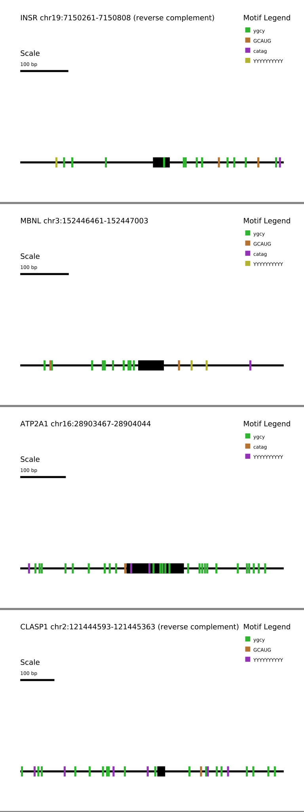

# Motif-mark

motif-mark.py creates graphics to visualize motifs in a given DNA or RNA sequence. It supports up to 10 simultaneous motifs and any number of input sequences from a FASTA file. Output is a SVG file of dimensions 1500 by 1000 * *n* pixels with *n* sequences. Motifs are drawn with contrasting colors, and an adjustable scale bar allows for visual comparison.

## Arguments

| -m     | --motifs_input         | input file with one motif per line, max 10        |
| ------ | ---------------------- | ------------------------------------------------- |
| **-s** | **--sequence_input**   | **FASTA input file with sequences**               |
| **-o** | **--output**           | **Output file name (omit extension, always SVG)** |
| **-l** | **--scale_bar_length** | **Length of the scale bar in bp (base pairs)**    |

## Example Output

